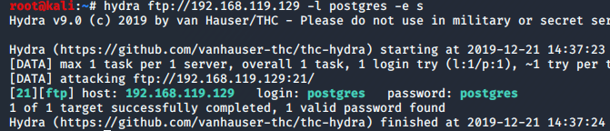
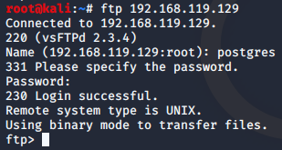
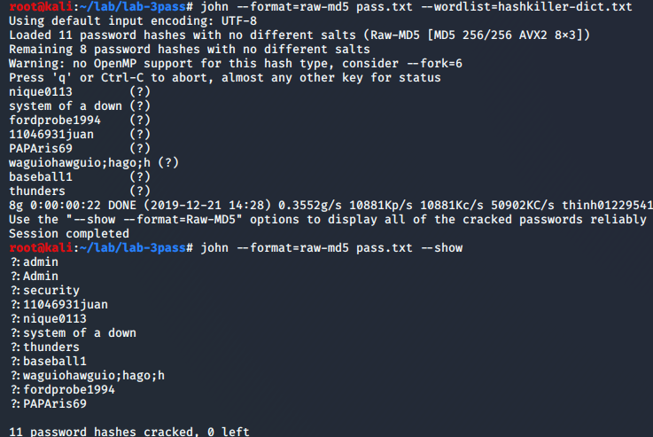
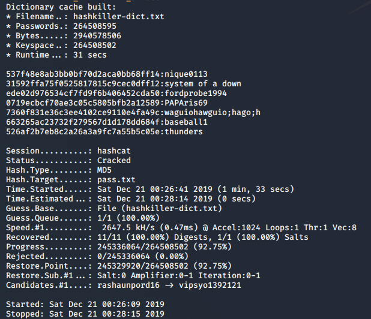
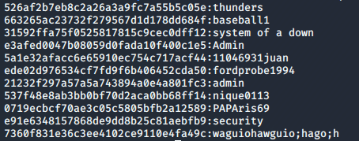

# 1. Usługa FTP - Hydra
Po przeprowadzeniu skanu sieci w poprzednim ćwiczeniu zauważyliśmy, że host `192.168.119.129` (_metasploitable_)
ma uruchomine usługi `FTP` oraz `PostgreSQL`. Możemy zatem spróbować złamać hasło do usługi `FTP` dla użytkowanika `postgres`.



Udało się!

Sprawdzimy czy jesteśmy się w stanie zalogować.



Poprawnie złamaliśmy hasło dla usługi `FTP`.


# 2. JohnTheRipper i Hashcat vs MD5

W obu przypadkach wykorzystujemy **potężną** wordlistę ze strony [HashKiller](https://hashkiller.co.uk/ListManager/Download).

#### JohnTheRipper



#### Hashcat (wsparcie GPU)





Złamane hasła
```
526af2b7eb8c2a26a3a9fc7a55b5c05e:thunders
663265ac23732f279567d1d178dd684f:baseball1
31592ffa75f0525817815c9cec0dff12:system of a down
e3afed0047b08059d0fada10f400c1e5:Admin
5a1e32afacc6e65910ec754c717acf44:11046931juan
ede02d976534cf7fd9f6b406452cda50:fordprobe1994
21232f297a57a5a743894a0e4a801fc3:admin
537f48e8ab3bb0bf70d2aca0bb68ff14:nique0113
0719ecbcf70ae3c05c5805bfb2a12589:PAPAris69
e91e6348157868de9dd8b25c81aebfb9:security
7360f831e36c3ee4102ce9110e4fa49c:waguiohawguio;hago;h
```
