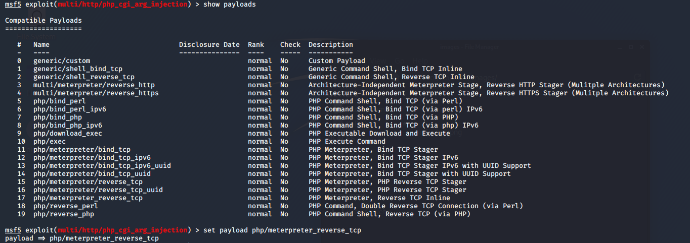

# Raport
## Krzysztof Zdulski
### 303731

# 1. Skan sieci
Wykonuję ogólny skan sieci w poszukiwaniu hostów. 

Hosty `192.168.119.129` oraz `192.168.119.130` to maszyny _metasploitable_ i _vulnix_.
Natomiast `192.168.119.5` to nasza maszyna Kali Linux, a `192.168.119.254` to host VMWare z serwerem DHCP.

Dalej wykonujemy skan `SYN` oraz `OS` dla interesujących nas hostów.

# 2. Skan podatności 

- [Openvas](scans/openvas.html)
- [Nessus](scans/nessus.html)

Wybrałem podatność `CVE-2012-1823`

# 3. Ekploitacja podatności

Zaczynamy od wyszukania eksploitów powiązanych z wybraną podatnością. 
Po wyszukaniu wybieramu odpowiedni exploit oraz ustawiamy opcje `RHOSTS` na nasz cel.

Następnie wybieramy payload `mterpreter_reverse_tcp`.

Wyświetlamy opcje naszego payloadu i ustawiamy `LHOST` na IP Kali Linuxa.

Gdy ustawiliśmy już wszytskie opcje wpisujemy `exploit` lub `run`. 
Widzimy, że udało nam się otworzyć sesję _meterpreter_.

Możemy teraz wykonywać polecenia na maszynie, którą udało się skompromitować. 
Możemy np. utworzyć nowy process `bash` i sprawdzić w imieniu jakigo użytkowanika wykonujemy polcenia.
W tym przypadku jest to użytkownik `www-data`, domyślny użytkowanik serwerów HTTP.

# 4. Listowanie użytkowników SMTP 

Podczas skanowania sieci zauważyliśmy, że host `192.168.119.130` (`vulnix`) ma otwarty port 25 - `SMTP`.
Korzystając z modułu _auxilary_ w metasploit możemy spróbować wylistować użytkowników `SMTP`.

Zaczynamy od znalezienia modułu korzystając z funckji `search` w metasploitable. 

Widzimy, że modułem, który chcemy wykorzytsać jest `smpt_enum`. 
Wybieramy ten moduł oraz ustawiamy jego parametr `RHOSTS.`
Jeśli chcemy użyć innej listy użytkowników możemy to zrobić zmieniając paramter `USER_FILE`.

Po wpisaniu `run` czekamy chwilę, aż moduł znajdzie użytkowników.

# 5. Złamanie hasła SSH

Podczas skanowania sieci zauważyliśmy, że host `192.168.119.130` (`vulnix`) ma otwarty port 22 - `SSH`.
Korzystając z modułu _auxilary_ w metasploit możemy spróbować złamać hasło do usługi `SSH` dla użytkowanika user.

Korzystamy z modułu `ssh_login`.

Po ustawieniu paramterów uruchamiamy moduł i czekamy na rezultaty.

Dodatkowo _metasploit_ utworzył za nas sesje ssh do której jeśli chcemy możemy się podłączyć.
