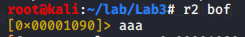

# Eksploitacja binarna - 'buffer overflow'

## Potrzebne narzędzia
 - `gcc` (compiler)
 - `gdb` (debugger)
 - Python 2.7
   - `pip2` (do zaintslowania biblioteki)
   - biblioteka `pwntools`
 - `radare2`


## Plan tutoriala

1. Konfiguracja środowiska 
    1. Instalacja narzędzi
    2. Stworzenie podatnej aplikacji
2. Analiza i eksploitacja aplikacji za pomocą narzędzia `radare2`
    1. Uruchomienie `radare2`
    2. Analiza podatnej funkcji
    3. Stworzenie pliku z danymi wejściowymi
    4. Debuggowanie aplikacji
    5. Eksploitacja 
3. Wykorzystanie biblioteki `pwntools` i eksploitacja aplikacji za pomocą Pythona
    1. Uszkodznie (crash) aplikacji
    2. Eksploitacja i shellcode
    
## 1. Konfiguracja środowiska

### Instalacja narzędzi

W celu poprawnego wykonania tego modułu należy zainstalować Pythona w wersji 2.7.
Na systemach Linux bazujących na Debianie wystarczy użyć polecenia `sudo apt install python`.
Następnie instalujemy Package Installer for Python (pip), 
podobnie jak w przypadku Pythona wystarczy polecenie `sudo apt install python-pip`.
Jeśli instalacja przebiegła pomyślnie po wpisaniu polecenia `pip` powiniśmy otrzymać poniższą informację:


`gcc` powinno być domyślnie zainstalowane na większości dystrybucji Linuxa, 
jednak jeśli nie jest, instalujemy pakiet _build-essentials_: `sudo apt install build-essential`.
Podobnie _gdb_: `sudo apt install gdb`.

### Stworzenie podatnej aplikacji

Na potrzeby tego modułu podatna aplikacja została już wcześniej napisana.
```c
#include <stdio.h>
#include <string.h>
#include <stdlib.h>

void ask_for_name()
{
    char name[12] = {0};
    puts("What's your name?");
    gets(name);
    if(strlen(name) > 12) {
       puts("Nope, it's too long for me");
       exit(1);
    }
    printf("Hi %s!\n", name);
}

int main()
{
    ask_for_name();
    return 0;
}
```

Do skompliowania aplikacji używamy polecenia `gcc <source-file> -std=c99 -fno-stack-protector -z execstack -w -o <output-file>`. 
Te argumenty są potrzebne, by stos był wykonywalny (ang. executable).
Dodatkowo, wyłączamy losowe adresowanie przestrzeni wirtualnej, żeby adres stosu nie zmieniał się przy każdym wykonaniu programu. 
W tym celu wykonujemy polecenie `echo 0 > /proc/sys/kernel/randomize_va_space` - polecenie musi zostać wykonane z uprawnieniami *root*.

Podatność znajduje się w funkcji `void ask_for_name()` i spowodowana jest użyciem funckji `gets(char* str)`, która wczyta do bufora `char* name` dowolną ilość danych.
Następnie do sprawdzenia długości wprowadzonych danych wykorzystana jest funkcja `strlen (const char* str)`, 
którą bardzo łatwo oszukać, gdyż używa ona znaku _null_ (0x00 w ASCII) do sprawdzenia długości stringa.

## 2. Analiza aplikacji za pomocą narzędzia _radare2_

### Uruchomienie _radare2_

W celu rozpoczęcia analizy programu uruchamiamy _radare2_ poleceniem `radare2 <file>` lub krócej `r2 <file>`. 
Analizujemy wszystkie elementy pliku wpisując polecenie `aaa`. 



Jeśli chcecmy uzyskać więcej informacji o danym poleceniu lub możliwych poleceniach wpisujemy `?`. 
Wypisujemy wszytkie funkcje - `alf` (_analyze_ -> _functions_ -> _list_):


Widzimy, że _radare2_ znalazło m.in. funkcje `main` i `ask_for_name`. Program rozpoczyna wykonanie w `entry0`.
Widać również funkcje z biblioteki standardowej takie jak `put`, `gets`, `printf`, itp.

Żeby przejść do danej funkcji wpisujemy `s <function>`, np. `s sym.ask_for_name`.


Jak widać adres, w którym się znajdujemy zmienił się i jesteśmy teraz na początku funkcji `ask_for_name`.

### Analiza podatnej funkcji

Żeby wyświetlić zdeassemblowany kod funckji wpisujemy `pdf`.


_radare2_ bardzo ułatwia nam czytanie kodu. Pokazały się stringi, które napisaliśmy w C,
jak również wykonania funkcji z biblioteki, a nawet przyjmowane przez nie argumenty oraz zwracane typy danych.
Na samej górze widzimy, że SP (stack pointer) przesuwany jest o 16 byteów. 
Pod adresem `0x000011b0` widać porównanie wartości zwróconej przez funckje `strlen` oraz stałej `0x0c` czyli 12 w systemie dziesiętnym. 
Kolejną instrukcją jest warunkowa instrukacja jump, która w połączeniu z poprzednią instrukcją `cmp` jest odpowiednikiem _ifa_ w C. 
Wpisując `VV` możemy przejść w tryb wyświetlający schemat blokowy naszej funckji.
Kilkając `p` możemy zmieniać sposób wyświetlania.


Skoro już mniej więcej rozumiemy działanie funckji w assemblerze, możemy przejść do jej uruchomienia. Prześledzimy wtedy zachowanie rejestrów oraz stosu i spróbujemy wykorzytsać znalezioną podatność.

### Stworzenie pliku z danymi wejściowymi

Nasza apliakcja pobiera dane z wejścia standardowego _stdin_, 
żeby przekazać te dane z poziomu programu _radare2_ musimy umieścić przykładowe dane w pliku. `echo "Krzysztof" > stdin.bin`. 
Następnie należy utowrzyć plik konfiguracyjny _rarun2_ o dowolnej nazwie, np. `profile.rr2`.

```
#!/usr/bin/rarun2
stdin=./stdin.bin
```

### Debuggowanie aplikacji

W celu rozpoczęcia debugowania musimy zrestartować _rarun2_ w trybie debug. W tym celu należy zamknąć program, `q` lub `Ctrl+D`, 
a następnie uruchomić go z flagą `-d` - `r2 -e dbg.profile=<rarun2-file> -d <file>`.
Zauważmy, że w trybie debugowania zmieniły się adresy funckji, o czym zostaliśmy poinformowani przy uruchomieniu.


Ustawiamy breakpoint (pułapkę) na samym początku funkcji `ask_for_name` - `db sym.ask_for_name`.


Widzimy, że przy pierwszej instrukcji pojawiło się **b** oznaczające ustawiony pod tym adresem breakpoint. 
Wznawiamy wykonanie programu używając polecenia `dc`, a następnie przechodzimy do interaktywnego trybu debugowania wpisując `V!`.
Teraz poza kodem assemblera widzimy również zawartość rejestrów oraz stosu. 


Za pomocą `S` (`Shift+s`) przechodzimy do kolejnych instrukcji. 
Pojawi się wskaźnik `rip` pokazujący gdzie w danym momencie się znajdujemy.

Bezpośrednio po wykonaniu funckji `gets` dane z naszego pliku zostaną wczytane na stos.

 

Nasze dane nie były dłuższe niż 12 znaków, więc zmieściły się na stosie i spodziewamy się zaakceptowania danych przez program. 
Kontynuujemy debugowanie i faktycznie, program 'skacze' do fragmentu dotyczącego wyświetlenia poprawnej wiadomości. 


Zmiana danych na dłuższe niż 12 znaków, np. `Krzysztof Zdulski` 
i analiza zachowania programu pozostawiona jest dla czytelnika w ramach ćwiczenia pracy z _radare2_.

### Eksploitacja 

Podczas analizy kodu funkcji `ask_for_name` zauwayliśmy, że do zweryfikowania długości wejścia wykorzystno funkcje `strlen`.
Funkcja ta kończy wykonanie gdy natrafi na _null character_, więc jesli w środku naszego wejścia umieścimy ten char, 
to funkcja zwróci mniejszą wartość. 

Zmieńmy zatem nasz plik wejściowy `echo -e "Krzysztof\x00This is a long message" > stdin.bin`. 
Zdebuggujmy nasz program jescze raz, tym razem breakpoint możemy ustawić zaraz po wykonaniu funckji `gets` - `db sym.ask_for_name+47`.

Widzimy, że cała wartość umieszczona została na stosie, a pod adresem `0x0x7fffffffe1cd` znajduje się podany przez nas `null character`. 


Po wykonaniu funkcji `strlen` zwrócona wartość znajduje się w resjestrze `rax` i jest to 9.


Udało nam się oszukać program, zaakceptował on nasze wejście. 
Kontynuujemy debugowanie, pomyślnie wyświetlamy wiadomość 'Hi Krzysztof!'. Zatrzymajmy się tuż przed instrukcją `leave`.
Instrukcja ta przesunie naszą ramkę stosu oraz wczyta wartość do rejestru `rbp`. 
Wykonujemy kolejny krok i widzimy, że to `rbp` została wczytana wartość `0x2061207369207369`.


Po odwróceniu i zapisaniu w ASCII odpowiada to "is is a ", czyli jesteśmy w stanie zmienić wartość rejestru `rbp`,
a zatem i `rip`, ponieważ instrukacja `ret` wczyta adres za `rbp` to rejestru `rip`.
Ponieważ wyłączyliśmy losowe adresy przestrzeni wirtualnej wiemy, że adres stosu zawsze bedzie taki sam, 
w naszym przypadku `0x7fffffffe1e0`.
Wiemy, że jesteśmy w stanie manipulować rejestrem `rbp` oraz znajdującym się za nim rejestrem `rip`. 
Wystraczy więc ustawić `rip` na adres stosu, żeby móc wykonać nasz własny kod.
Adres poprzedniej ramki w tym momencie nie ma już znaczenia.

`echo -e "Krzysztof\x00\x00\x00This-rbp\xd8\xe1\xff\xff\xff\x7f\x00\x00" > stdin.bin`

Udało nam się ustawić Instruction Pointer (rejestr `rip`) na adres stosu, do którego mamy bezpośredni dostęp.


W kolejnej części za pomocą Pythona i biblioteki _pwntools_ wyślemy shellcode, który zostanie wykonany przez nasz program.

